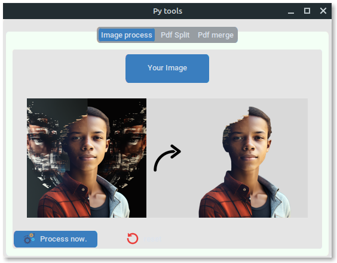

# Py-tools

Welcome to our Python application! This project aims to create a robust and efficient utility tool that simplifies tedious tasks and automates workflows using the customtkinter library to build a graphical user interface.

The project was built using the MVVM (Model-View-ViewModel) architecture, which allows us to separate the UI (View) from the business logic (ViewModel) and the data (Model). This separation of concerns enables us to easily scale the application, making it more maintainable and testable.

Our objective is to provide a versatile platform that can handle a wide range of tasks, from image processing to working with PDFs, Word docs, and anything else you can think of. Our tool aims to make your life easier and save you valuable time by automating repetitive and tedious tasks.

## Prerequisites
The application requires Python version 3.10 or higher to be installed on your system. You can download and install Python from the official Python website https://www.python.org/downloads/.

install all requirements by running this command
`pip install -r requirements.txt`

## Execute the application
`python3 app.py`

## Contributing
Contributions to the application are welcome. If you find a bug or have a feature request, please submit an issue on the GitHub repository. If you would like to contribute code, please fork the repository and submit a pull request.

## License
This application is licensed under the MIT License. See the LICENSE file for more information.